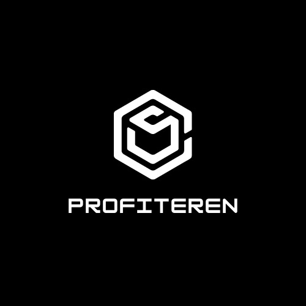

# DODO-price-advantage-tweet-alert

We are team technophiles and participated in Chainlink Hackathon 2021. Our Problem Definition : The project who rates a bot that tracks DODO price advantage and tweets about it in real-time.

Team Members: Rushabh Thakkar, Divy Patel, Denish Kalariya, Yug Thakkar, and Shubham Vyas.

# Our Project Name: Profiteren

**A Trading Bot that tracks DODO price advantage and tweets about it in real-time.**

  

Inspiration
>Blockchain is a revolutionary technology that is popularly known as the backbone of Digital Cryptocurrencies, which have been generating incredible hype in the last decade. Not working on blockchain and cryptocurrency would be like people who didn’t believe on the internet 2 decades back. 

What it does
>Our Twitter bot tracks DODO’s price advantage and tweets about it in real-time.

How we built it
>Firstly, we have made an Infura account and took credentials from there. We used API to fetch data from there. We made a code on python that fetches data. We made a Twitter account to use it as a bot. Then we made a code for the Twitter bot in which we had added ‘access token’ and ‘API keys’ for the account. By adding these files, we made a real-time Twitter bot using python.

Challenges we ran into
>Running the code on the cloud for 24/7
>Finding contract address to fetch price data
>Twitter Bot API credentials
>Real time 

Accomplishments that we're proud of
>Fetched the exchange prices from chainlink and Dodo in real-time.
>Successfully deployed Twitter Bot on Microsoft Azure Cloud Services to keep running 24/7

What we learned
>We have learned about Blockchain-based contracts.
>Infura Platforms
>Make a Twitter Bot
>Learnt to deploy python code on Azure cloud services,

What's next for Untitled
To create and maintain a database and get an analytics dashboard

Follow us on [Twitter](https://twitter.com/_profiteren_)

 **Team Details**
- Rushabh Thakkar

[Linkedin](https://www.linkedin.com/in/rushabhthakkar/)
[Github](https://github.com/rushabh1605)

- Divy Patel

[Linkedin](www.linkedin.com/in/divy-patel-7b369118b/)
[Github](https://github.com/Divy2000)

- Denish Kalariya

[Linkedin](https://www.linkedin.com/in/denish-kalariya-b22a641ba/)
[Github](https://github.com/Dk-21)

- Yug Thakkar

[Linkedin](https://www.linkedin.com/in/yug-thakkar-6a0021179/)
[Github](https://github.com/yugthakkar16)

- Shubham Vyas

[Linkedin](https://www.linkedin.com/in/shubhamvyas7/)
[Github](https://github.com/shhubhxm)

